Error 404

# That page took a wrong turn.

The link you followed may be broken, or the page may have moved. Let's get you somewhere useful.

[Go Home &nbsp; :material-home:](index.md){ .md-button .md-button--primary }
[Quick Start &nbsp; :material-rocket-launch:](quickstart.md){ .md-button }

-   :material-book-open-variant:{ .lg .middle } **Quick Start**

    ---

    Install `kq` and send your first query in under five minutes.

    [:octicons-arrow-right-24: Quick Start](quickstart.md)

-   :material-console:{ .lg .middle } **CLI Reference**

    ---

    Every flag, every command, every argument.

    [:octicons-arrow-right-24: CLI Reference](cli-reference.md)

-   :material-frequently-asked-questions:{ .lg .middle } **FAQ**

    ---

    Answers to the questions we get most often.

    [:octicons-arrow-right-24: FAQ](faq.md)

-   :material-tools:{ .lg .middle } **Troubleshooting**

    ---

    Connection issues, TLS errors, stale state — start here.

    [:octicons-arrow-right-24: Troubleshooting](troubleshooting.md)

