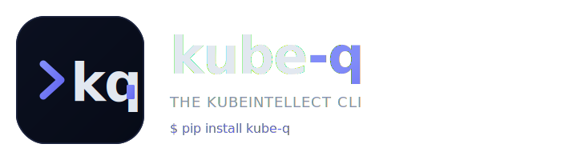
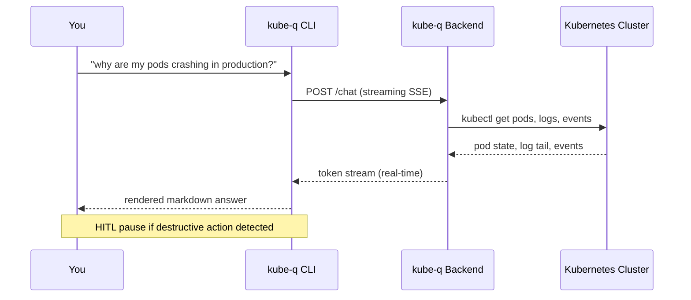

---
hide:
  - navigation
  - toc
---

<div class="kq-hero" markdown>

<span class="kq-hero-eyebrow">v1.4.0 · stable release</span>



# Talk to Kubernetes. In plain English.

`kube-q` is an AI-native terminal client for Kubernetes. Query, debug, and operate any cluster the way you think — with streaming answers, session memory, human-in-the-loop approvals, and a full browser REPL.

[Get Started &nbsp; :material-rocket-launch:](quickstart.md){ .md-button .md-button--primary }
[View on GitHub &nbsp; :material-github:](https://github.com/MSKazemi/kube_q){ .md-button }

<div class="kq-badges">
  <span class="kq-badge">:material-tag: v1.4.0</span>
  <span class="kq-badge">:material-language-python: Python 3.12+</span>
  <span class="kq-badge">:material-scale-balance: MIT License</span>
  <span class="kq-badge">:material-lightning-bolt: Streaming SSE</span>
  <span class="kq-badge">:material-docker: Docker Ready</span>
  <span class="kq-badge">:material-database: SQLite History</span>
  <span class="kq-badge">:material-shield-check: HITL Safe</span>
</div>

</div>

<div class="kq-stats kq-reveal" markdown>

<div class="kq-stat">
  <span class="kq-stat-number" data-target="<5">0</span>
  <span class="kq-stat-label">minutes to first query</span>
</div>
<div class="kq-stat">
  <span class="kq-stat-number" data-target="30">0</span>
  <span class="kq-stat-label">slash commands</span>
</div>
<div class="kq-stat">
  <span class="kq-stat-number" data-target="100">0%</span>
  <span class="kq-stat-label">local session history</span>
</div>
<div class="kq-stat">
  <span class="kq-stat-number" data-target="0">0</span>
  <span class="kq-stat-label">kubectl flags to memorise</span>
</div>

</div>

<span class="kq-eyebrow">Why kube-q</span>
## A Kubernetes client that understands you
<p class="kq-section-sub">Stop context-switching between docs, cheat-sheets and your terminal. Ask a question, get an answer — with the evidence right there.</p>

<div class="grid cards kq-reveal" markdown>

-   :material-chat-processing:{ .lg .middle } **Plain-English Queries**

    ---

    No more kubectl reference card. Ask *"why are my pods crashing in production?"* and get a structured, expert-level answer in seconds.

    [:octicons-arrow-right-24: CLI Reference](cli-reference.md)

-   :material-history:{ .lg .middle } **Persistent Session Memory**

    ---

    Every conversation is saved locally in SQLite. Resume any past session, search across all history with full-text FTS5 queries, branch at any turn.

    [:octicons-arrow-right-24: Session History](session-history.md)

-   :material-shield-check:{ .lg .middle } **Human-in-the-Loop Safety**

    ---

    Before a destructive action runs, `kube-q` pauses and shows you the exact command, risk level and diff. You approve — or deny.

    [:octicons-arrow-right-24: HITL Guide](hitl.md)

-   :material-paperclip:{ .lg .middle } **File Attachments**

    ---

    Embed YAML manifests, logs, configs and more with `@filename`. The AI sees full file contents inline alongside your question.

    [:octicons-arrow-right-24: File Attachments](file-attachments.md)

-   :material-monitor:{ .lg .middle } **Browser Terminal**

    ---

    The full `kq` REPL in any browser via Docker — xterm.js, WebSocket, node-pty. No duplicated logic. Every command, every stream, identical.

    [:octicons-arrow-right-24: Web UI](web-ui.md)

-   :material-currency-usd:{ .lg .middle } **Token & Cost Tracking**

    ---

    Every response shows token count and elapsed time. `/tokens` gives a full breakdown with estimated dollar cost, configurable per model.

    [:octicons-arrow-right-24: Token Tracking](token-tracking.md)

-   :material-swap-horizontal:{ .lg .middle } **Multi-Backend & Multi-Cluster**

    ---

    One CLI, three backends: kube-q server, direct OpenAI, or Azure OpenAI — pick with `--backend`. Switch kubectl context live via `/context`, bundle cluster + keys into named profiles, add custom slash commands with plugins.

    [:octicons-arrow-right-24: Configuration](configuration.md#backend-selection)

</div>

---

<span class="kq-eyebrow">Install</span>
## Up and running in under a minute
<p class="kq-section-sub">Pick your flavour. One command and you're in.</p>

=== ":material-package-variant: pipx (recommended)"

    ```bash
    pipx install kube-q
    kq
    ```

=== ":material-language-python: pip"

    ```bash
    pip install kube-q
    kq
    ```

=== ":material-apple: Homebrew"

    ```bash
    brew tap MSKazemi/kube-q
    brew install kube-q
    kq
    ```

=== ":material-docker: Docker"

    ```bash
    docker run -p 3000:3000 \
      -e KUBE_Q_URL=https://kube-q.example.com \
      -e KUBE_Q_API_KEY=your-key \
      ghcr.io/mskazemi/kube_q:latest
    ```

    Open `http://localhost:3000` for a full REPL in your browser.

!!! tip "Point at your backend"
    ```bash
    kq --url https://kube-q.example.com --api-key your-key
    ```
    Or set it once in `~/.kube-q/.env` and never type it again. See [Configuration](configuration.md).

---

<span class="kq-eyebrow">Live demo</span>
## Real conversation, real cluster
<p class="kq-section-sub">This is a verbatim kube-q session — from a vague question to a safe, approved fix.</p>

<div class="kq-terminal kq-reveal">
<div class="kq-terminal-titlebar">
  <span class="kq-terminal-dot kq-terminal-dot--red"></span>
  <span class="kq-terminal-dot kq-terminal-dot--amber"></span>
  <span class="kq-terminal-dot kq-terminal-dot--green"></span>
  <span class="kq-terminal-title">kq — kube-q REPL  ·  ns: production</span>
</div>

```text
kube-q  v1.4.0  |  session abc123  |  ns: production
────────────────────────────────────────────────────

You> why are the pods in the payment service crashlooping?

kube-q> Investigating... ━━━━━━━━━━━━━━━━━━━━  (3 tool calls)

  The payment-service pods are in CrashLoopBackOff due to a missing
  environment variable: DATABASE_URL is not set in the deployment spec.

  The container exits immediately with:
    Error: required env DATABASE_URL is not set

  Fix:
  ┌─────────────────────────────────────────────────────────────┐
  │ kubectl set env deployment/payment-service \                │
  │   DATABASE_URL=postgres://db.prod.svc:5432/payments         │
  └─────────────────────────────────────────────────────────────┘

  (1.8s · 820 tokens)

You> apply the fix

kube-q> ╭─ Action requires approval ──────────────────────────╮
        │  kubectl set env deployment/payment-service \       │
        │    DATABASE_URL=postgres://db.prod.svc:5432/        │
        │                                                     │
        │  Risk: medium  ·  namespace: production             │
        │  Type /approve to proceed or /deny to cancel.       │
        ╰─────────────────────────────────────────────────────╯
HITL> /approve

kube-q> Done. Rollout triggered. Monitoring...
        All 3 pods are Running (45s).
```

</div>

---

<span class="kq-eyebrow">Comparison</span>
## kube-q vs. raw kubectl
<p class="kq-section-sub">Both have their place — kube-q is built for the moments when you'd rather think out loud than recite syntax.</p>

<div class="kq-reveal" markdown>
<table class="kq-compare">
  <thead>
    <tr>
      <th>Capability</th>
      <th>raw kubectl</th>
      <th>kube-q</th>
    </tr>
  </thead>
  <tbody>
    <tr>
      <td>Natural-language queries</td>
      <td class="kq-cross">✗</td>
      <td class="kq-check">✓ streaming</td>
    </tr>
    <tr>
      <td>Multi-resource root-cause analysis</td>
      <td>manual (logs + events + describe)</td>
      <td class="kq-check">✓ automatic</td>
    </tr>
    <tr>
      <td>Persistent session history</td>
      <td>shell history only</td>
      <td class="kq-check">✓ SQLite + FTS5 search</td>
    </tr>
    <tr>
      <td>Conversation branching</td>
      <td class="kq-cross">✗</td>
      <td class="kq-check">✓ <code>/branch</code></td>
    </tr>
    <tr>
      <td>Human-in-the-loop approvals</td>
      <td class="kq-cross">✗</td>
      <td class="kq-check">✓ for destructive ops</td>
    </tr>
    <tr>
      <td>Token &amp; cost accounting</td>
      <td>N/A</td>
      <td class="kq-check">✓ per-response + session</td>
    </tr>
    <tr>
      <td>Browser REPL</td>
      <td class="kq-cross">✗</td>
      <td class="kq-check">✓ Docker image</td>
    </tr>
    <tr>
      <td>Python SDK</td>
      <td>client-go</td>
      <td class="kq-check">✓ sync &amp; async</td>
    </tr>
  </tbody>
</table>
</div>

---

<span class="kq-eyebrow">How it works</span>
## Architecture at a glance
<p class="kq-section-sub">Everything runs through a streaming backend. Your cluster credentials never leave the server.</p>



---

<span class="kq-eyebrow">Built for</span>
## Use cases we've heard
<p class="kq-section-sub">From the first-time learner to the 3 AM on-call responder.</p>

<div class="kq-usecases kq-reveal" markdown>

<div class="kq-usecase" markdown>
#### :material-fire: Incident response
First signal of trouble, you ask `kube-q` what changed. It correlates events, logs and recent rollouts so you stop hunting and start deciding.
</div>

<div class="kq-usecase" markdown>
#### :material-school: Learning k8s
A junior engineer can ask *"what does a readiness probe do for this pod?"* and get an answer grounded in the actual manifest — not a blog post.
</div>

<div class="kq-usecase" markdown>
#### :material-clipboard-check: Safer rollouts
Destructive actions pause for an explicit `/approve`. Risk level and blast-radius are surfaced before anything touches the cluster.
</div>

<div class="kq-usecase" markdown>
#### :material-magnify-scan: Forensic search
`/search "oom killed"` walks every past session. Every investigation becomes institutional memory for the next one.
</div>

<div class="kq-usecase" markdown>
#### :material-source-branch: Scenario exploration
`/branch` forks a conversation the moment you want to try a different fix — without losing the original line of reasoning.
</div>

<div class="kq-usecase" markdown>
#### :material-robot-happy: Automation &amp; bots
Drive `kube-q` from a script or chatbot via the Python SDK. The same streaming, same HITL, same audit trail.
</div>

</div>

---

<span class="kq-eyebrow">What's included</span>
## One project. Three surfaces.
<p class="kq-section-sub">Pick the interface that fits the moment — they all share the same backend and session store.</p>

<div class="grid cards kq-reveal" markdown>

-   :material-console:{ .lg .middle } **Terminal Client**

    ---

    The `kq` command — a feature-rich interactive REPL built on `prompt_toolkit` with Tab-completion, command history, multi-line input, rich markdown rendering, and a full set of [slash commands](commands.md).

-   :material-language-python:{ .lg .middle } **Python SDK**

    ---

    Use `KubeQClient` (sync) or `AsyncKubeQClient` directly in scripts, notebooks, or your own tools — no CLI required. Full streaming and event-model support.

    [:octicons-arrow-right-24: SDK reference](sdk.md)

-   :material-web:{ .lg .middle } **Browser Terminal**

    ---

    A Docker image that runs the full `kq` REPL in any browser via xterm.js + WebSocket + node-pty. Embeddable in iframes. Each tab is an isolated process.

    [:octicons-arrow-right-24: Web UI](web-ui.md)

</div>

---

<div class="kq-quote kq-reveal" markdown>
kube-q turns the terminal into a conversation. The things I used to copy-paste from Stack Overflow — `describe`, `get events`, `logs --previous`, `top pods` — all just happen when I ask a question. It's the shortest path from *"something's wrong"* to *"here's what and here's why."*
<cite>— The tool the author wishes they'd had on every 3 AM page.</cite>
</div>

---

<div class="kq-cta kq-reveal" markdown>

## Ready to try it?

Install in one command. Point at your backend. Start asking questions.

[Quick Start &nbsp; :material-rocket-launch:](quickstart.md){ .md-button .md-button--primary }
[Star on GitHub &nbsp; :material-star-outline:](https://github.com/MSKazemi/kube_q){ .md-button }

</div>
